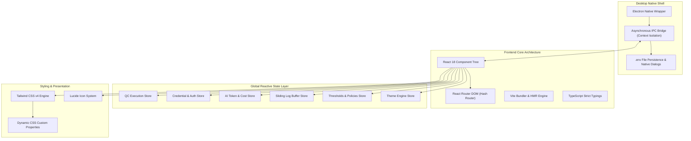
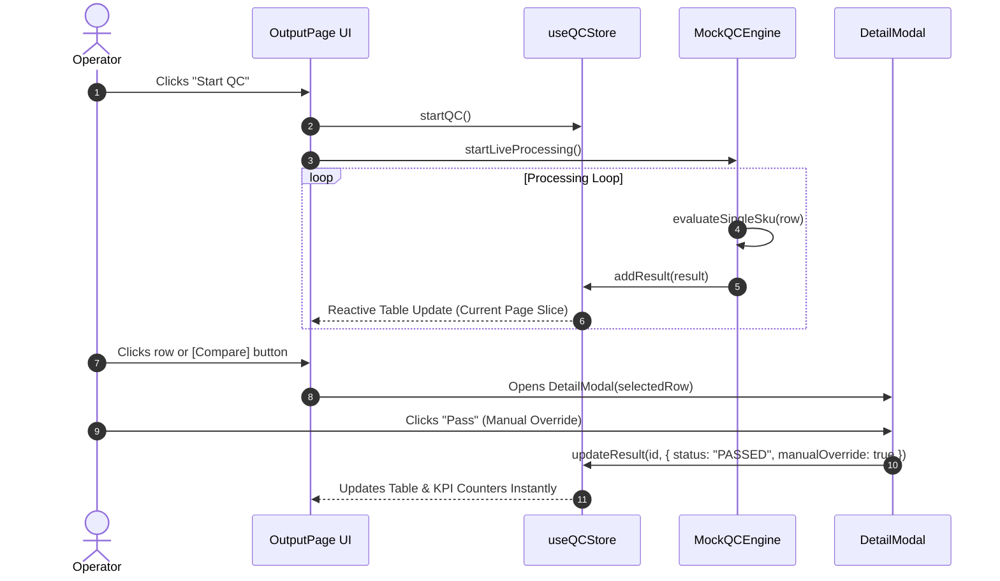
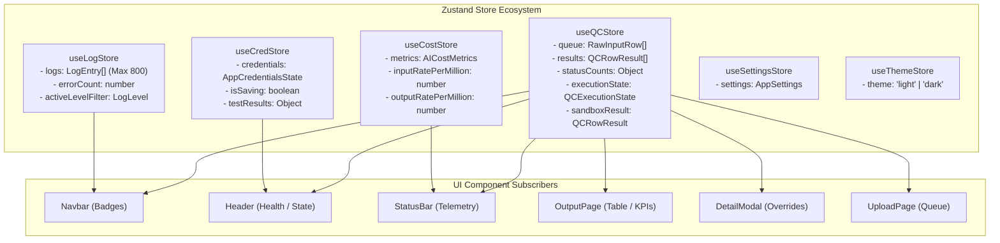
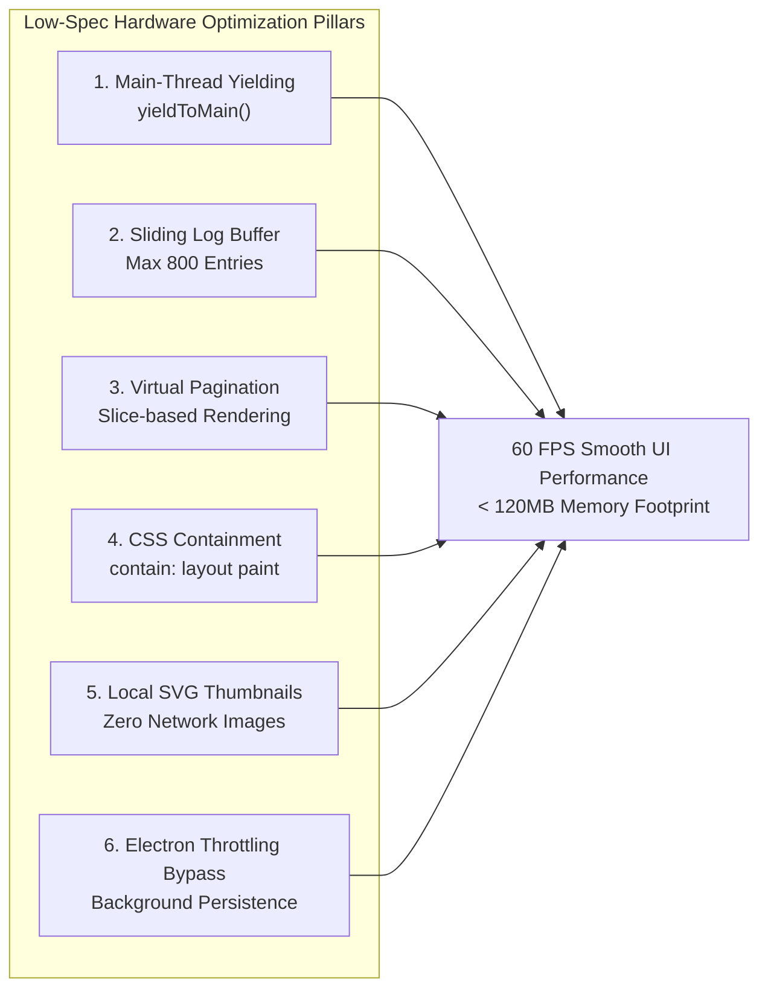
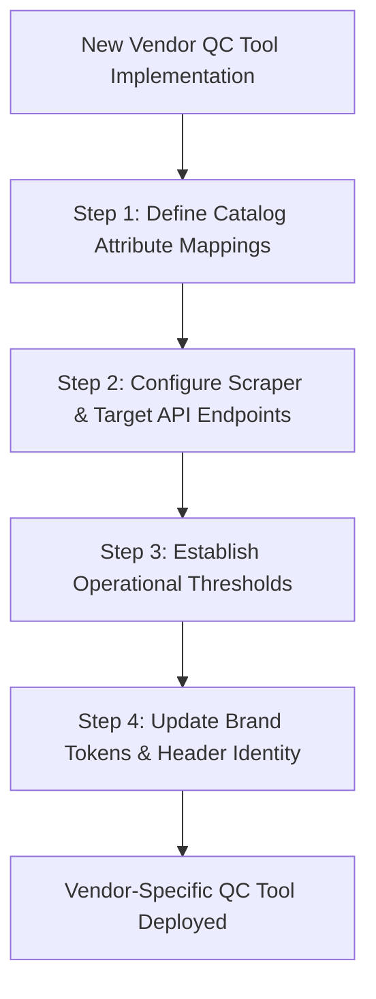

# ENTERPRISE VENDOR-NEUTRAL QC FRONTEND SPECIFICATION & IMPLEMENTATION BLUEPRINT

---

## 1. EXECUTIVE SUMMARY & SYSTEM OBJECTIVES

This document provides an exhaustive, production-grade architectural specification and implementation blueprint for building **Vendor-Neutral Quality Control (QC) and Catalog Listing Verification Desktop Tools**.

The primary purpose of this standardized frontend architecture is to provide multi-channel e-commerce operators, distributors, brand aggregators, and retail compliance engineers with a high-performance desktop interface capable of cross-comparing upstream supplier product catalogs (the "Vendor") against live marketplace listings (such as Amazon SP-API, Walmart Marketplace, Target Plus, or Google Shopping).

```
+----------------------------------------------------------------------------------------------------+
|                                STANDARDIZED VENDOR QC ARCHITECTURE                                 |
+----------------------------------------------------------------------------------------------------+
|                                                                                                    |
|  [ UPSTREAM VENDOR SOURCE ]                                            [ TARGET MARKETPLACE ]      |
|  - Dealer Portal Scrapers                                              - Amazon SP-API             |
|  - Vendor B2B APIs                                                     - Walmart Marketplace API   |
|  - EDI 832 / TSV / Excel Feeds                                         - Target Plus / eBay        |
|                |                                                                  |                |
|                +--------------------------+---------------------------------------+                |
|                                           |                                                        |
|                                           v                                                        |
|                           +-------------------------------+                                        |
|                           |   DESKTOP QC VERIFICATION     |                                        |
|                           |           ENGINE              |                                        |
|                           |  - NLP Title Matching         |                                        |
|                           |  - Price Variance Tolerance   |                                        |
|                           |  - Pack Multiplier Checks     |                                        |
|                           |  - Visual Similarity Hashing  |                                        |
|                           |  - Claude AI Reasoner Engine  |                                        |
|                           +---------------+---------------+                                        |
|                                           |                                                        |
|                                           v                                                        |
|  +----------------------------------------------------------------------------------------------+  |
|  |                 UNIFIED VENDOR-NEUTRAL FRONTEND INTERFACE & DESIGN SYSTEM                    |  |
|  |                                                                                              |  |
|  |  [ Global Header Shell ]       - Brand Badge | Live Engine Pulse | Multi-Service Health      |  |
|  |  [ Navigation Controller ]     - Ingestion | Stream | Export | Logs | Sandbox | Cost | Auth  |  |
|  |  [ Core Verification Views ]   - Low-Latency Paginated Virtual Tables & Modal Overrides      |  |
|  |  [ Diagnostic Telemetry ]      - Real-Time Token Meters | Sub-Penny Financial Projections    |  |
|  |  [ Global Status Bar ]         - Queue Ratios | Throughput SKU/min | Active IPC Connection   |  |
|  +----------------------------------------------------------------------------------------------+  |
|                                                                                                    |
+----------------------------------------------------------------------------------------------------+
```

### Core Architecture Principles

1. **Vendor Neutrality:** Zero hardcoded brand dependencies. The layout, schemas, color tokens, and workflows seamlessly adapt to any vendor or catalog format.
2. **Deterministic & AI-Assisted Verification:** Hybrid evaluation combining strict programmatic logic (price variance math, UPC digit matching, pack quantity equality) with semantic AI reasoning.
3. **High-Throughput / Zero UI-Jank:** Engineered for budget hardware, featuring cooperative main-thread scheduling (`yieldToMain`), DOM pagination, and memory-safe sliding log windows.
4. **Offline-First Secure Credential Isolation:** Sensitive API tokens, scraping passwords, and SMTP secrets persist locally in `.env` files via Electron IPC, with immediate in-memory UI masking.
5. **Universal Dark / Light Design System:** Comprehensive tokenized theme system engineered with high-contrast, accessible semantic status indicators.

---

## 2. TECHNOLOGY STACK SPECIFICATION

The frontend architecture is standardized on modern, enterprise-proven technologies optimized for desktop performance and developer maintainability.



### Stack Components Breakdown

| Layer | Technology | Specification & Role |
| :--- | :--- | :--- |
| **Desktop Wrapper** | Electron Native Shell | Provides native desktop window management, Chromium runtime control, OS file dialog access, and direct `.env` persistence. |
| **UI Library** | React 18 | Declarative component hierarchy utilizing functional components, `useMemo`, `useCallback`, `useDeferredValue`, and `lazy`/`Suspense` code splitting. |
| **Type Safety** | TypeScript Strict Mode | Comprehensive interface definitions for all domain models, catalog rows, validation errors, log entries, and settings. |
| **Build & Dev Tool** | Vite | Lightning-fast Hot Module Replacement (HMR) and optimized rollup production bundling. |
| **Routing** | React Router DOM (HashRouter) | Hash-based navigation (`/#/upload`, `/#/output`, etc.) ensuring route stability within Electron `file://` protocols. |
| **State Management** | Zustand (v5) | Lightweight, un-opinionated reactive stores with zero boilerplate, micro-selectors, and high-frequency state updates without top-level re-render cascading. |
| **Styling Engine** | Tailwind CSS v4 | Class-first layout styling paired with custom CSS color tokens, theme remaps, and responsive utilities. |
| **Spreadsheet Engine** | SheetJS (xlsx) | Client-side parsing of Excel (.xlsx/.xls) and CSV datasets, with auto-column width calculation and structured binary exports. |
| **Iconography** | Lucide React | Unified vector icon library providing consistent, lightweight UI symbols across all system components. |

---

## 3. DESIGN SYSTEM, TOKENS & TYPOGRAPHY SPECIFICATION

The standardized UI is built upon an 8-point spatial grid system, an enterprise font hierarchy, and a dual-mode semantic color palette.

### 3.1 Typography Scale & Font Architecture

```
Typography Scale Hierarchy
+------------------------------------------------------------------------------------+
| Display / H1       : 16px (1.000rem) | ExtraBold (800) | Tracking: -0.025em        |
| Section / H2       : 20px (1.250rem) | ExtraBold (800) | Tracking: -0.025em        |
| Card Header / H3   : 14px (0.875rem) | Bold (700)      | Tracking: +0.025em Uppercase
| Section Sub / H4   : 12px (0.750rem) | Black (900)     | Tracking: +0.050em Uppercase
| Body Regular       : 12px (0.750rem) | Medium (500)    | Line-Height: 1.50         |
| Caption / Meta     : 11px (0.687rem) | SemiBold (600)  | Line-Height: 1.40         |
| Micro / Pill Badge : 10px (0.625rem) | ExtraBold (800) | Tracking: +0.050em Uppercase
| Mono Data / IDs    : 11px-12px       | SemiBold (600)  | Font: Consolas / Monospace|
+------------------------------------------------------------------------------------+
```

* **Primary Font Family:** `-apple-system, BlinkMacSystemFont, "Segoe UI", Roboto, Helvetica, Arial, sans-serif`
* **Monospace Font Family:** `ui-monospace, SFMono-Regular, Menlo, Monaco, Consolas, "Liberation Mono", monospace`
* **Text Rendering Flag:** `text-rendering: optimizeSpeed;` for instant scrolling performance.

---

### 3.2 Dual-Theme Semantic Color Palette (Light & Dark)

The color system uses CSS custom variables configured via Tailwind v4 theme bindings.

```
                  THEME COLOR TOKEN SPECIFICATION MATRIX
+--------------------+-------------------------+-------------------------+
| Semantic Variable  | Light Theme Value       | Dark Theme Value        |
+--------------------+-------------------------+-------------------------+
| --app-bg           | #f8fafc (Slate 50)      | #0b1220 (Midnight Navy) |
| --app-card         | #ffffff (Pure White)    | #131c2e (Deep Obsidian) |
| --app-muted        | #f1f5f9 (Slate 100)     | #1a2438 (Dark Surface)  |
| --app-muted-2      | #e2e8f0 (Slate 200)     | #243049 (Border Accent) |
| --app-fg           | #0f172a (Slate 900)     | #e8eef8 (Ice White)     |
| --app-fg-secondary | #334155 (Slate 700)     | #cbd5e1 (Slate 300)     |
| --app-fg-muted     | #64748b (Slate 500)     | #94a3b8 (Slate 400)     |
| --app-line         | #e2e8f0 (Slate 200)     | #243049 (Muted Navy)    |
| --app-header       | #ffffff (White)         | #101828 (Charcoal Navy) |
| --scroll-track     | #f1f5f9 (Slate 100)     | #101828 (Charcoal Navy) |
| --scroll-thumb     | #cbd5e1 (Slate 300)     | #334155 (Slate 700)     |
| --overlay          | rgba(15, 23, 42, 0.55)  | rgba(2, 6, 23, 0.72)    |
+--------------------+-------------------------+-------------------------+
```

---

### 3.3 Visual Status Token Matrix

Every quality control outcome is mapped to a dedicated tripartite token structure: Background Tint, Text Color, and Border Stroke.

```mermaid
classDiagram
    class PASSED {
        +State: Catalog Match
        +Light_BG: Emerald-100 (#d1fae5)
        +Light_Text: Emerald-800 (#065f46)
        +Light_Border: Emerald-300 (#6ee7b7)
        +Dark_BG: rgba(6, 95, 70, 0.28)
        +Dark_Text: Emerald-300 (#6ee7b7)
        +Dark_Border: rgba(16, 185, 129, 0.35)
        +Glow_Pulse: 2.4s Green Ripple
    }

    class FAILED {
        +State: Critical Discrepancy
        +Light_BG: Red-100 (#fee2e2)
        +Light_Text: Red-800 (#991b1b)
        +Light_Border: Red-300 (#fca5a5)
        +Dark_BG: rgba(127, 29, 29, 0.28)
        +Dark_Text: Red-300 (#fca5a5)
        +Dark_Border: rgba(248, 113, 113, 0.35)
        +Glow_Pulse: 2.4s Red Ripple
    }

    class MANUAL_REVIEW {
        +State: Marginal Threshold / Review
        +Light_BG: Amber-100 (#fef3c7)
        +Light_Text: Amber-800 (#92400e)
        +Light_Border: Amber-300 (#fcd34d)
        +Dark_BG: rgba(120, 53, 15, 0.28)
        +Dark_Text: Amber-300 (#fcd34d)
        +Dark_Border: rgba(251, 191, 36, 0.35)
        +Glow_Pulse: 2.4s Amber Ripple
    }

    class SYSTEM_INFO {
        +State: Information & Telemetry
        +Light_BG: Blue-100 (#dbeafe)
        +Light_Text: Blue-800 (#1e40af)
        +Light_Border: Blue-200 (#bfdbfe)
        +Dark_BG: rgba(30, 64, 175, 0.28)
        +Dark_Text: Blue-300 (#93c5fd)
        +Dark_Border: rgba(37, 99, 235, 0.35)
    }

    class AI_ANALYTICS {
        +State: AI Reasoning & Confidence
        +Light_BG: Indigo-50 (#eef2ff)
        +Light_Text: Indigo-900 (#312e81)
        +Light_Border: Indigo-200 (#c7d2fe)
        +Dark_BG: rgba(49, 46, 129, 0.32)
        +Dark_Text: Indigo-200 (#c7d2fe)
        +Dark_Border: rgba(129, 140, 248, 0.35)
    }
```



---

### 3.4 Spatial Scale, Elevation & Layout Constraints

* **Layout Constraints:** Full viewport lock (`100vw` × `100vh`) with zero window-level body scrolling. All content scrolls within dedicated sub-containers.
* **Component Elevation:** Crisp, flat borders (`1px solid var(--app-line)`) with subtle micro-shadows (`shadow-xs` / `shadow-sm`) to maximize UI rendering speed.
* **Scrollbars:** Slim, rounded native Webkit scrollbars (`6px` width/height) styled to match theme background tracks.
* **Animation System:**
  * Status pulse glows (`verdict-pulse-pass`, `verdict-pulse-fail`, `verdict-pulse-review`) running 2.4s ease-in-out loops.
  * Accessibility override: All animations and transitions instantly collapse to `0.01ms` when `@media (prefers-reduced-motion: reduce)` is enabled.

---

## 4. GLOBAL APPLICATION SHELL & LAYOUT ARCHITECTURE

The root layout frame enforces a strict three-tier vertical structure: Fixed Top Header Shell, Route-driven Viewport Mainstage, and Persistent Bottom Status Bar.

```
+----------------------------------------------------------------------------------------------------+
| [GLOBAL HEADER SHELL] - Height: 64px (h-16)                                                        |
| +-------------------+  +-------------------------------------+  +-------+  +--------+  +--------+ |
| | [BRAND LOGO ICON] |  | TOOL NAME : [VENDOR NAME]           |  | THEME |  | BATCH  |  | HEALTH | |
| | Vendor Icon Pill  |  | Amazon SP-API & Catalog Comparator  |  | LIGHT |  | STATUS |  | BADGES | |
| +-------------------+  +-------------------------------------+  +-------+  +--------+  +--------+ |
+----------------------------------------------------------------------------------------------------+
| [GLOBAL TAB NAVIGATION BAR] - Height: 48px (h-12)                                                  |
| [UPLOAD (badge)] [OUTPUT (badge)] [EXPORT] [LOGS (badge)] [SANDBOX] [AI COSTS] [CREDENTIALS] [SET] |
+----------------------------------------------------------------------------------------------------+
|                                                                                                    |
| [MAINSTAGE ROUTE VIEWPORT CONTAINER] - Flex-1 (contain-paint, overflow-hidden)                     |
|                                                                                                    |
|   Active Page Component Rendered Here via React Router Outlet & Suspense Fallback                  |
|                                                                                                    |
+----------------------------------------------------------------------------------------------------+
| [PERSISTENT STATUS FOOTER BAR] - Height: 32px (h-8)                                                |
| HardDrive: Queue [X/Y] | Zap: Speed [X.X SKU/m] | Cpu: Tokens [X,XXX] | Dollar: Cost | IPC: Live   |
+----------------------------------------------------------------------------------------------------+
```

### 4.1 Shell Components Specification

#### A. Global Header Shell (`Header`)
* **Left Section:**
  * Rounded brand icon with gradient background (`w-10 h-10 rounded-xl bg-gradient-to-tr from-blue-600 to-cyan-500`).
  * Vendor tool title: `[VENDOR NAME] QC TOOL` in bold uppercase.
  * Vendor attribution badge: `[vendor-tag]` in a rounded pill badge.
  * Descriptive subtitle: `Amazon SP-API & Vendor Portal Listing Comparator`.
* **Right Section:**
  * Quick theme switcher (`ThemeToggle`).
  * Real-time engine state badge with animated emerald ping indicator (`RUNNING BATCH`, `STREAM PAUSED`, `BATCH FINISHED`, `ENGINE READY`).
  * Integration health pills showing live status for SP-API, Vendor Portal, and AI Engine.

#### B. Tab Navigation Bar (`Navbar`)
* Horizontal tab strip with active route indicator (`bg-blue-600 text-white`).
* Dynamic live badge counters:
  * **UPLOAD:** Displays number of valid queued rows.
  * **OUTPUT:** Displays total processed SKU results.
  * **LOGS:** Displays error count highlighted in red (`bg-red-100 text-red-700 font-bold`) or total log count.
* Tactile hover transitions with zero layout shift.

#### C. Persistent Status Footer (`StatusBar`)
* High-contrast dark background (`bg-slate-900 text-slate-300`).
* Live telemetry indicators:
  * **Queue Meter:** `Queue: [Processed]/[Total]` with highlighted values.
  * **Throughput Speedometer:** Calculated live speed in `SKU/min`.
  * **AI Token Counter:** Accumulated batch token consumption.
  * **Batch Cost Monitor:** Live financial cost in USD formatted to 4 decimals.
  * **IPC Channel Status:** Direct Electron bridge connectivity indicator.
  * **Software Version:** Current build release tag (`v1.0.0-rc`).

---

## 5. COMPLETE PAGE-BY-PAGE IMPLEMENTATION SPECIFICATIONS

---

### 5.1 Page 1: Product Ingestion & Data Validation Engine (`UploadPage`)

The Ingestion Engine allows operators to import raw product catalog feeds via TSV copy-paste or Excel/CSV drag-and-drop file upload, executing instant client-side validation against schema rules.

```
+----------------------------------------------------------------------------------------------------+
| UPLOAD PAGE LAYOUT WIREFRAME                                                                       |
+----------------------------------------------------------------------------------------------------+
| [Top Banner] Product Ingestion & Validation  | [Vendor Badge]       [Load Sample]  [Reset Input]   |
+----------------------------------------------------------------------------------------------------+
| [LEFT COLUMN: DATA INGESTION] (7 cols)          | [RIGHT COLUMN: DIAGNOSTIC REPORT] (5 cols)       |
| +---------------------------------------------+ | +----------------------------------------------+ |
| | Tabs: [Copy-Paste TSV] | [Upload File]      | | | Diagnostic Status: [ ALL VALID / X ISSUES ]  | |
| +---------------------------------------------+ | +----------------------------------------------+ |
| | Required: PART SKU | ASIN | Brand | Line... | | | 1. [x] Required Columns Present              | |
| | [=========================================] | | | 2. [x] Data Format & Length Verification     | |
| | [                                         ] | | | 3. [x] Ingestion Completeness                | |
| | [ Multi-line Monospace Ingestion Textarea ] | | +----------------------------------------------+ |
| | [                                         ] | | Breakdown Summary:                             | |
| | [=========================================] | | [ Total Rows ]  [ Ready for QC ]  [ Errors ]   | |
| +---------------------------------------------+ | +----------------------------------------------+ |
| | Detected: 1,240 rows                        | | Issues List Box (if errors present):           | |
| |                  [Validate] [START QC BATCH]| | - Row 4: ASIN invalid format (must be 10 char) | |
| +---------------------------------------------+ | +----------------------------------------------+ |
|                                                 | Valid Rows Table Preview (First 10 items)      | |
+----------------------------------------------------------------------------------------------------+
```

#### Detailed Feature Specifications:
1. **Dual Ingestion Modes:**
   * **TSV / Spreadsheet Paste Mode:** Monospace auto-scrolling textarea supporting direct copy-paste from Excel or Google Sheets.
   * **File Dropzone Mode:** Drag-and-drop file container supporting `.xlsx`, `.xls`, and `.csv` formats, with an optional native OS file explorer fallback via Electron IPC.
2. **Deterministic Validation Pipeline (`ValidatorService`):**
   * Automatically detects delimiters (Tab `\t`, Pipe `|`, Comma `,`, Semicolon `;`).
   * Inspects header row for flexible aliases (`sku`/`part`, `asin`, `brand`, `line`/`category`, `upc`/`barcode`).
   * Validates required columns, ASIN format (10 alphanumeric characters), and UPC format (8–14 digits).
3. **Diagnostic Report Panel:**
   * Three-step visual checklist with status lights.
   * Metrics cards displaying Total Rows, Ready for QC, and Errors Flagged.
   * Scrollable issue list pinpointing exact row numbers, field names, and error reasons.
   * Read-only preview table showing the first 10 valid parsed rows.
4. **Primary Action Triggers:**
   * `Validate Data`: Triggers instant validation and logs results.
   * `Start QC Batch`: Initializes the execution store and launches background processing.
   * `Load Sample SKUs`: Ingests pre-configured vendor test fixtures.
   * `Reset`: Clears inputs, file states, and validation reports.

---

### 5.2 Page 2: Live QC Output & Comparison Stream (`OutputPage`)

The operational nerve center of the tool, providing a real-time, paginated stream of verified SKUs, interactive comparison modals, and manual override capabilities.

```
+----------------------------------------------------------------------------------------------------+
| OUTPUT PAGE LAYOUT WIREFRAME                                                                       |
+----------------------------------------------------------------------------------------------------+
| [Top Banner] Live QC Comparison Stream       [START QC] [PAUSE] [RESUME] [STOP] [RESET RUN]        |
+----------------------------------------------------------------------------------------------------+
| [KPI METRICS BANNER]                                                                               |
| [ Completion Rate ] [ Passed Count ] [ Failed Count ] [ Review Count ] [ Speed ] [ Time Left ]     |
| [ 842 / 1200 (70%)] [ 640 (76%)   ] [ 142 (17%)   ] [ 60 (7%)     ] [ 84/min] [ 254s left ]    |
+----------------------------------------------------------------------------------------------------+
| [TOOLBAR] Filter: [ALL] [PASSED] [FAILED] [REVIEW] | Search: [ Q Search SKU/ASIN... ] | Show: [15] |
+----------------------------------------------------------------------------------------------------+
| [PAGINATED LIVE STREAM TABLE]                                                                      |
| +----------+------------+------------+---------------+---------+-----------+---------+-----------+ |
| | Verdict  | PART SKU   | ASIN       | Brand & Line  | Title % | Price Var | Pack    | Actions   | |
| +----------+------------+------------+---------------+---------+-----------+---------+-----------+ |
| | [PASSED] | SKU-884901 | B07XQ94ABC | Sierra Marine | 95%     | +2.4%     | 1 : 1   | [Compare] | |
| | [FAILED] | SKU-104922 | B0000AXN5U | Seachoice     | 48%     | +45.0%    | 1 vs 2  | [Compare] | |
| | [REVIEW] | SKU-338190 | B01N10VZ28 | Teleflex      | 68%     | +14.0%    | 1 : 1   | [Compare] | |
| +----------+------------+------------+---------------+---------+-----------+---------+-----------+ |
+----------------------------------------------------------------------------------------------------+
| [PAGINATION FOOTER] Showing 1 to 15 of 842 matching SKUs | [<<] [< Prev] Page 1 of 57 [Next >] [>>]|
+----------------------------------------------------------------------------------------------------+
```

#### Detailed Feature Specifications:
1. **Tactile Execution Control Bar:**
   * Dynamic button states showing only valid actions based on execution state (`IDLE`, `RUNNING`, `PAUSED`, `STOPPED`, `COMPLETED`).
   * Tactile press animations with shadow depression and active color scaling.
2. **Real-Time KPI Metrics Banner:**
   * **Completion Rate:** Exact fraction (`Processed / Total`), percentage badge, and visual progress bar.
   * **Passed / Failed / Review Cards:** Absolute counts paired with dynamic percentage shares.
   * **Throughput Speedometer & ETA Calculator:** Live SKU processing speed and estimated remaining time.
3. **Filter, Search & Pagination Controls:**
   * One-click verdict filter pills (`ALL`, `PASSED`, `FAILED`, `MANUAL REVIEW`).
   * Debounced and deferred search input (`useDeferredValue`) filtering across SKU, ASIN, Brand, Line, UPC, and AI Reasoning.
   * Configurable page size selector (`10`, `15`, `25`, `50` SKUs per page).
   * Complete pagination controls (First, Previous, Current Page, Next, Last).
4. **Side-by-Side Comparison Detail Modal (`DetailModal`):**
   * Visual side-by-side listing cards comparing Vendor Portal vs Amazon SP-API.
   * Attribute comparison gauges for Title Match, Price Variance, Pack Quantity Match, and UPC Match.
   * AI Analysis callout displaying Claude AI reasoning and confidence score.
   * Quick manual override buttons (`Pass`, `Fail`, `Review`) to modify verdicts on the fly.



---

### 5.3 Page 3: Export Quality Control Reports (`ExportPage`)

Allows operators to export quality control audit datasets into formatted spreadsheets and CSV files.

```
+----------------------------------------------------------------------------------------------------+
| EXPORT PAGE LAYOUT WIREFRAME                                                                       |
+----------------------------------------------------------------------------------------------------+
| [Top Banner] Export Quality Control Reports                          [ Feedback Notification Toast]|
+----------------------------------------------------------------------------------------------------+
| [SUMMARY CARDS]                                                                                    |
| [ Total Verified : 1,240 ] [ Passed : 940 (76%) ] [ Failed : 220 (18%) ] [ Review : 80 (6%) ]      |
+----------------------------------------------------------------------------------------------------+
| [EXPORT ACTIONS BAR]                                                                               |
| Actions: [Download Full Report (.xlsx)] [Issues Only (.xlsx)] [Passed Only (.xlsx)] [Raw CSV]     |
+----------------------------------------------------------------------------------------------------+
| [DATASET SCHEMA PREVIEW (Showing first 10 rows)]                                                   |
| +----------+------------+------------+---------------+---------+-----------+---------+-----------+ |
| | Verdict  | PART SKU   | ASIN       | Brand         | Title % | Price Var | Pack    | AI Reason | |
| +----------+------------+------------+---------------+---------+-----------+---------+-----------+ |
| | PASSED   | SKU-884901 | B07XQ94ABC | Sierra Marine | 95%     | +2.4%     | Yes     | All match | |
| | FAILED   | SKU-104922 | B0000AXN5U | Seachoice     | 48%     | +45.0%    | No      | Pack diff | |
| +----------+------------+------------+---------------+---------+-----------+---------+-----------+ |
+----------------------------------------------------------------------------------------------------+
```

#### Detailed Feature Specifications:
1. **Segmented Export Actions (`ExcelService`):**
   * **Full Report (`.xlsx`):** Complete dataset containing all verified SKUs.
   * **Issues Only (`.xlsx`):** Filtered spreadsheet containing only `FAILED` and `MANUAL REVIEW` listings.
   * **Passed Only (`.xlsx`):** Verified listings matching all catalog criteria.
   * **Raw CSV Export:** Plain-text CSV format for downstream ERP ingestion.
2. **Automated Spreadsheet Formatting:**
   * Auto-calculated column widths ensuring zero text truncation in Microsoft Excel.
   * Descriptive header titles: `#`, `QC VERDICT`, `OVERRIDE`, `PART SKU`, `ASIN`, `BRAND`, `CATEGORY/LINE`, `UPC`, `TITLE MATCH %`, `PRICE VARIANCE %`, `IMAGE SIMILARITY %`, `PACK QTY MATCH`, `UPC MATCH`, `VENDOR TITLE`, `VENDOR PRICE ($)`, `AMAZON TITLE`, `AMAZON PRICE ($)`, `AI VERDICT REASON`, `TIMESTAMP`.
3. **Memory-Safe Static Preview:**
   * Limits DOM table rendering to the first 10 items to prevent UI lag on datasets containing tens of thousands of rows.

---

### 5.4 Page 4: System & Activity Logs (`LogsPage`)

A real-time diagnostic terminal capturing system events, scraping activity, API queries, and error traces.

```
+----------------------------------------------------------------------------------------------------+
| LOGS PAGE LAYOUT WIREFRAME                                                                         |
+----------------------------------------------------------------------------------------------------+
| [Top Banner] System & Scraping Activity Logs               [Pause Logs] [Clear Logs] [Export TXT]  |
+----------------------------------------------------------------------------------------------------+
| Level: [ALL] [INFO] [SUCCESS] [WARN] [ERROR] | Category: [ALL] [SYSTEM] [LOGIN] [SCRAPER] [API]... |
| Search: [ Q Search logs...               ]   | Show: [30/page]                                     |
+----------------------------------------------------------------------------------------------------+
| [TERMINAL LOG VIEWER]                                                                              |
| (*) (*) (*) qc-live-runtime-stream.log                                                             |
| +------------------------------------------------------------------------------------------------+ |
| | [10:42:01] [INFO]    [LOGIN]      Checking session auth for vendor portal...                   | |
| | [10:42:02] [INFO]    [SCRAPER]    [SKU-8849] GET Vendor portal listing...                     | |
| | [10:42:02] [INFO]    [AMAZON_API] [ASIN: B07X] SP-API Listings/Items query...                  | |
| | [10:42:03] [SUCCESS] [QC_ENGINE]  [SKU-8849] Verdict: PASSED - Title 95%, Price +2.4%         | |
| | [10:42:05] [ERROR]   [QC_ENGINE]  [SKU-1049] Verdict: FAILED - Critical Pack mismatch (1 vs 2)| |
| +------------------------------------------------------------------------------------------------+ |
+----------------------------------------------------------------------------------------------------+
| [TERMINAL FOOTER] Showing 30 of 800 entries | [<<] [< Prev] Page 1 of 27 [Next >] [>>]             |
+----------------------------------------------------------------------------------------------------+
```

#### Detailed Feature Specifications:
1. **Categorized Log Taxonomy:**
   * **Levels:** `INFO`, `SUCCESS`, `WARNING`, `ERROR`.
   * **Categories:** `SYSTEM`, `LOGIN`, `SCRAPER`, `AMAZON_API`, `QC_ENGINE`, `AI_CALL`, `ERROR`.
2. **Ring Buffer Memory Capping:**
   * Enforces an 800-entry sliding window limit (`MAX_LOGS = 800`). Older entries are automatically evicted to maintain minimal memory footprint.
3. **Interactive Terminal Features:**
   * Terminal window styling with dark background and colored status dots.
   * Expandable JSON metadata drawer on click.
   * Search filtering with deferred state (`useDeferredValue`).
   * Stream pause control (`Pause Logs` / `Resume Stream`).
   * Multi-format export (`.txt` and `.json`).

---

### 5.5 Page 5: Isolated Single-SKU Sandbox Debugger (`SandboxPage`)

A dedicated diagnostic lab allowing compliance engineers to test, inspect, and fine-tune individual SKU comparisons without running full batches.

```
+----------------------------------------------------------------------------------------------------+
| SANDBOX PAGE LAYOUT WIREFRAME                                                                      |
+----------------------------------------------------------------------------------------------------+
| [Top Banner] Sandbox Single-SKU Debugger           Presets: [Match Case] [Mismatch] [Review Case]  |
+----------------------------------------------------------------------------------------------------+
| [LEFT COLUMN: INPUT & VERDICT CARDS] (5 cols)   | [RIGHT COLUMN: COMPARISON MATRIX] (7 cols)       |
| +---------------------------------------------+ | +----------------------------------------------+ |
| | Single-Row Input (TSV):                     | | | Granular Comparison Matrix: SKU-8849 | ASIN  | |
| | [ SKU-8849  B07XQ94ABC  Sierra  030999... ] | | | +----------------+ +----------------+        | |
| | [Run Sandbox Test]       [Push to Output]   | | | | Title Match    | | Price Variance |        | |
| +---------------------------------------------+ | | | 95% (Met)      | | +2.4% (Within) |        | |
| | Calculated Verdict (Click to Override):     | | | +----------------+ +----------------+        | |
| | +-----------+ +-----------+ +-------------+ | | | | Pack Qty Match | | UPC Match      |        | |
| | |  PASSED   | |  FAILED   | |   REVIEW    | | | | 1 vs 1 (Exact)   | | Exact Match    |        | |
| | |  (PULSE)  | |           | |             | | | +----------------+ +----------------+        | |
| | +-----------+ +-----------+ +-------------+ | | +----------------------------------------------+ |
| +---------------------------------------------+ | | Claude AI Synthesis:                         | |
| | Sandbox Execution Trace:                    | | | "All primary attributes match: Title 95%..." | |
| | [10:45:01] Parsing single-row input...      | | +----------------------------------------------+ |
| | [10:45:02] Vendor Portal Scraper simulated..| | Raw API & Catalog Response Data:               | |
| | [10:45:03] SP-API response received...      | | [ Vendor JSON Object ] [ Amazon JSON Object ]  | |
| +---------------------------------------------+ | +----------------------------------------------+ |
+----------------------------------------------------------------------------------------------------+
```

#### Detailed Feature Specifications:
1. **Interactive Verdict Cards with Animated Glow:**
   * Three large status cards (`PASSED`, `FAILED`, `REVIEW`) featuring pulsating glow animations matching the active verdict.
   * Interactive manual overrides: Clicking any card immediately overrides the verdict and logs the manual action.
2. **Granular Comparison Matrix:**
   * 6-point evaluation grid: Title Match Score, Price Variance, Image Similarity, Pack Quantity, UPC Match, and Model/MPN Match.
3. **Dual Raw JSON Payload Viewers:**
   * Side-by-side JSON tree inspector displaying raw Vendor Portal catalog objects and Amazon SP-API responses.
4. **Push-to-Output Pipeline:**
   * `Push to Output` button clones the sandbox evaluation and pushes it directly into the live output queue with a unique tracking ID.

---

### 5.6 Page 6: AI Token & Inference Cost Analytics (`AICostsPage`)

A dedicated financial monitor tracking Claude AI token usage, per-SKU costs, and catalog-scale billing projections.

```
+----------------------------------------------------------------------------------------------------+
| AI COSTS PAGE LAYOUT WIREFRAME                                                                     |
+----------------------------------------------------------------------------------------------------+
| [Top Banner] AI Token & Inference Cost Analytics                      [Reset Batch Metrics]        |
+----------------------------------------------------------------------------------------------------+
| [LEFT COLUMN: CURRENT BATCH & PROJECTIONS] (7 cols) | [RIGHT COLUMN: LIFETIME ANALYTICS] (5 cols)  |
| +-------------------------------------------------+ | +------------------------------------------+ |
| | 1) Current Batch Run (Processed: 1,240 SKUs)    | | | 2) Lifetime Persisted Cost Analytics     | |
| | +---------------------+ +---------------------+ | | | Total Lifetime Cost : $8.5420            | |
| | | a) AI Token Usage   | | b/c) Live Cost      | | | | Total SKUs Processed: 1,240              | |
| | | In : 1,116,000      | | Per SKU: $0.00540   | | | | Lifetime Avg / SKU  : $0.00688           | |
| | | Out: 223,200        | | Total  : $6.6960    | | | | Total Tokens        : 1,705,900          | |
| | | Tot: 1,339,200      | |                     | | | +------------------------------------------+ |
| | +---------------------+ +---------------------+ | | Model Rate Reference:                      | |
| | d) Live Batch Scaling Projections:              | | | Claude Haiku 4.5:                        | |
| | [ 1,000 SKUs : $5.40 ]  [ 10,000 SKUs: $54.00 ] | | | - Input Pricing : $3.00 / 1M tokens      | |
| +-------------------------------------------------+ | | - Output Pricing: $15.00 / 1M tokens     | |
| | Interactive Catalog Size Cost Calculator:       | | +------------------------------------------+ |
| | Enter target SKU count: [ 5,000     ]           |                                                |
| | Estimated Total Cost  : $27.00                  |                                                |
| +-------------------------------------------------+                                                |
+----------------------------------------------------------------------------------------------------+
```

#### Detailed Feature Specifications:
1. **Four Core Batch Telemetry Metrics:**
   * **a) AI Token Usage:** Input Tokens, Output Tokens, and Total Batch Tokens consumed.
   * **b) Live Cost Per SKU:** Real-time financial cost per individual SKU evaluation.
   * **c) Total Batch Cost:** Accumulated dollar amount incurred during the active session.
   * **d) Scaling Projections:** Instant cost calculations for 1,000 SKUs and 10,000 SKUs.
2. **Interactive Catalog Size Calculator:**
   * Allows operators to enter any target catalog size (e.g., 50,000 SKUs) and calculate real-time estimated API costs based on active pricing models.
3. **Lifetime Persisted Analytics:**
   * Tracks total lifetime cost, total SKUs processed, average cost per SKU, and total tokens consumed across all historical sessions.

---

### 5.7 Page 7: API Credentials & Access Control (`CredentialsPage`)

Secure authentication center managing credentials for upstream vendor portals, Amazon SP-API, Claude AI, and SMTP alert relays.

```
+----------------------------------------------------------------------------------------------------+
| CREDENTIALS PAGE LAYOUT WIREFRAME                                                                  |
+----------------------------------------------------------------------------------------------------+
| [Top Banner] API Credentials & Access Control                 [SAVE TO .ENV & MASK KEYS]           |
+----------------------------------------------------------------------------------------------------+
| [SECTION A: VENDOR PORTAL AUTH]                 | [SECTION B: AMAZON SP-API AUTH]                  |
| - Vendor Portal URL                             | - LWA Client ID (App ID)                         |
| - Account Email / Dealer ID                     | - LWA Client Secret [Show/Hide]                  |
| - Portal Password [Show/Hide]                   | - LWA Refresh Token [Show/Hide]                  |
| Live Diagnostic: [ 200 OK - 124ms ]             | Live Diagnostic: [ OAuth Token Valid - 180ms ]   |
| [Test Vendor Login]                             | [Test SP-API Connection]                         |
+-------------------------------------------------+--------------------------------------------------+
| [SECTION C: CLAUDE AI ENGINE]                   | [SECTION D: EMAIL & ALERTS (SMTP)]               |
| - Anthropic API Key [Show/Hide]                 | - Sender Email Address                           |
| - Fixed Model: Claude Haiku 4.5                 | - Gmail App Password (16-char) [Show/Hide]       |
| Live Diagnostic: [ HTTP 200 - 210ms ]           | - QC Manager Alert Recipient                     |
| [Test Claude Endpoint]                          | [Send Test Notification]                         |
+----------------------------------------------------------------------------------------------------+
```

#### Detailed Feature Specifications:
1. **Quad-Section Credential Architecture:**
   * **Section A (Vendor Portal):** Portal login URL, Dealer Email/ID, and Portal Password.
   * **Section B (Amazon SP-API):** LWA Client ID, Client Secret, Refresh Token, and Region (`NA`/`EU`/`FE`).
   * **Section C (Claude AI Engine):** Anthropic API Key and Model configuration.
   * **Section D (Email Alerts):** Sender Email, Gmail 16-character App Password, Recipient Email, and Port (`465` SSL/TLS).
2. **Security & Persistence Architecture:**
   * Direct `.env` read/write via Electron IPC bridge.
   * Automatic secret masking: Upon saving, input fields are wiped from active React memory and replaced with masked placeholders (`•••••••• (Stored in .env)`).
   * Password visibility toggles (`Eye` / `EyeOff` icons) for sensitive inputs.
3. **Live Handshake Ping Testers:**
   * Dedicated test button on every card executing simulated/live connection handshakes.
   * Detailed diagnostic response boxes showing response latency, endpoint URLs, rate limit bucket balances, and account authorization scopes.

---

### 5.8 Page 8: QC Operational Thresholds & Engine Settings (`SettingsPage`)

Provides fine-grained control over discrepancy thresholds, scraper behavioral policies, worker concurrency, and theme appearance.

```
+----------------------------------------------------------------------------------------------------+
| SETTINGS PAGE LAYOUT WIREFRAME                                                                     |
+----------------------------------------------------------------------------------------------------+
| [Top Banner] QC Thresholds & Engine Settings                     [Reset Defaults] [Save Prefs]     |
+----------------------------------------------------------------------------------------------------+
| [APPEARANCE THEME SELECTOR]                                                                        |
| Mode: [ Light ]  [ Dark ]  [Toggle Button]                                                         |
+----------------------------------------------------------------------------------------------------+
| [1) DISCREPANCY & SIMILARITY THRESHOLDS]        | [2) SCRAPER & SYSTEM BEHAVIORS]                  |
| - Max Allowed Price Variance : [ 15%  ] [Slider]| [x] Reuse Vendor Portal Session Cookies          |
| - Min Title Similarity       : [ 70%  ] [Slider]| [x] Run Scraping in Headless Mode                |
| - Min Image Similarity Score : [ 70%  ] [Slider]| [x] Strict Pack Quantity Match                   |
| - AI Confidence Auto-Approve : [ 85%  ] [Slider]| [x] Auto-Pause on Error Spike                    |
|                                                 +--------------------------------------------------+
|                                                 | [3) CONCURRENCY & WORKER THREADS]                |
|                                                 | - Parallel Worker Threads: [ 3 Workers ] [Slider]|
|                                                 | - Request Timeout        : 30s                   |
+----------------------------------------------------------------------------------------------------+
```

#### Detailed Feature Specifications:
1. **Discrepancy Threshold Sliders:**
   * **Price Variance Threshold (`1% - 50%`, default: `15%`):** Maximum allowed percentage variance between vendor price and marketplace retail before triggering an alert.
   * **Title Similarity Threshold (`40% - 99%`, default: `70%`):** NLP semantic match score required for automatic pass.
   * **Image Similarity Threshold (`40% - 95%`, default: `70%`):** Visual hash match score threshold.
   * **AI Auto-Verify Threshold (`50% - 99%`, default: `85%`):** Confidence score required for automated approval without human review.
2. **Scraper Behavioral Policies:**
   * **Session Cookie Reuse:** Prevents redundant login roundtrips.
   * **Headless Scraping:** Runs browser automation without visual overhead.
   * **Strict Pack Quantity:** Instantly flags pack multiplier differences.
   * **Auto-Pause on Error Spike:** Automatically halts batch execution if 3 consecutive failures occur.
3. **Concurrency Engine Tuning:**
   * Configurable worker threads (`1 - 10` workers) adjusting API request rates and scraper parallelization.

---

## 6. REACTIVE STATE MANAGEMENT ARCHITECTURE (ZUSTAND)

The state architecture is partitioned into six decoupled Zustand stores, ensuring localized reactivity without unnecessary global re-renders.



### Store Schemas & Responsibility Matrix

| Store Identifier | State Properties | Key Action Handlers |
| :--- | :--- | :--- |
| **`useQCStore`** | `rawInputText`, `uploadedFileName`, `validationSummary`, `queue`, `results`, `activeSkuIndex`, `executionState`, `elapsedSeconds`, `sandboxResult`, `statusCounts` | `startQC()`, `pauseQC()`, `resumeQC()`, `stopQC()`, `resetQC()`, `addResult()`, `updateResult()`, `overrideSandboxStatus()`, `pushSandboxToOutput()` |
| **`useCredStore`** | `credentials` (Vendor, Amazon, Claude, Email), `isSaving`, `isTesting`, `saveSuccessMessage`, `testResults` | `loadCredentialsFromEnv()`, `updateVendor()`, `updateAmazon()`, `updateClaude()`, `updateEmail()`, `saveToEnv()`, `testConnection()` |
| **`useCostStore`** | `metrics` (Batch & Lifetime token counts, Dollar costs, Cost per SKU, Projections), Rates | `recordSkuTokens(input, output)`, `resetBatchCost()`, `resetLifetimeCost()` |
| **`useLogStore`** | `logs` (Sliding buffer capped at 800 entries), `errorCount`, `activeLevelFilter`, `activeCategoryFilter`, `searchQuery` | `addLog(level, category, message, meta)`, `clearLogs()`, `setActiveLevelFilter()`, `setIsStreamingPaused()` |
| **`useSettingsStore`** | `settings` (Price threshold, Title similarity, Concurrency workers, Scraper flags) | `updateSettings(updates)`, `resetDefaults()` |
| **`useThemeStore`** | `theme` (`light` \| `dark`) | `setTheme(mode)`, `toggleTheme()`, `bootTheme()` |

---

## 7. HARDWARE PERFORMANCE & LOW-SPEC OPTIMIZATION STRATEGY

To ensure fluid performance on budget warehouse laptops and low-spec workstations, the frontend architecture implements six strict optimization pillars:



### Optimization Implementation Details:

1. **Cooperative Main-Thread Scheduling (`yieldToMain`):**
   * Uses `requestIdleCallback` with a 32ms timeout fallback to `setTimeout(0)`.
   * Executed between consecutive SKU evaluations to allow the browser to paint frames, preventing UI freeze during heavy batch processing.
2. **Incremental Verdict Counters (`statusCounts`):**
   * Pre-calculates `passed`, `failed`, and `manualReview` tallies in Zustand during item ingestion rather than re-filtering arrays on every render.
3. **DOM Virtualization via Paginated Slicing:**
   * Renders only the active page window (`10` to `50` rows) into the DOM tree, keeping memory overhead flat regardless of whether the dataset has 500 or 50,000 SKUs.
4. **Hardware-Accelerated CSS Containment:**
   * Containers apply `contain: layout paint` and `content-visibility: auto` to isolate reflow and repaint boundaries.
   * `text-rendering: optimizeSpeed` prioritizes rapid font rasterization.
5. **Deterministic Local SVG Thumbnail Generation (`placeholderImage`):**
   * Generates inline SVG data URIs via deterministic SKU hashing, eliminating remote image downloads and visual decode bottlenecks.
6. **Electron Background Execution Flags:**
   * Configured with `disable-renderer-backgrounding` and `disable-background-timer-throttling` to ensure batch verification loops continue uninterrupted even when the application window is minimized or occluded.

---

## 8. VENDOR-NEUTRAL ADAPTATION & REUSABILITY GUIDE

This template is engineered to serve as the unified frontend standard for any supplier, distributor, or manufacturer verification system.



### 8.1 Generic Schema Mapping Reference

To adapt this specification to a new vendor (e.g., Marine Supplies, Automotive Parts, Electronics, Apparel), map the supplier's catalog fields to the standardized internal schema:

| Standard Frontend Field | Example: Marine Supplier | Example: Auto Parts Supplier | Example: Apparel Distributor |
| :--- | :--- | :--- | :--- |
| **`partSku`** | `SKU-SWD-884901` | `AP-BRAKE-7729` | `APP-SHIRT-BLK-LG` |
| **`asin`** | `B07XQ94ABC` | `B0912XYZ44` | `B089KLL901` |
| **`brand`** | `Sierra Marine` | `Bosch Auto` | `Champion Athletic` |
| **`line` / `category`** | `Electrical / Starters` | `Braking / Rotors` | `Sportswear / Tops` |
| **`upc`** | `030999884901` | `028851004921` | `194957284910` |
| **`price`** | Dealer Wholesale Price | Distributor Net Cost | Unit Wholesale Cost |
| **`packQuantity`** | Packaging Count | Box Quantity | Pack Count (Single/Multi) |

---

## 9. CONCLUSION & FRONTEND IMPLEMENTATION CHECKLIST

This specification establishes an immutable, enterprise-grade frontend template for Quality Control tools. By adhering strictly to the token scales, decoupled state architecture, and hardware optimization strategies defined herein, engineering teams can rapidly assemble high-performance, vendor-neutral verification applications.

```
====================================================================================================
                        STANDARD FRONTEND IMPLEMENTATION CHECKLIST
====================================================================================================
[x] 1. Desktop Shell Setup     : Electron window + Context Isolation IPC bridge for .env read/write.
[x] 2. Design Token System     : Tailwind CSS v4 variables with full Light & Dark mode support.
[x] 3. Global Navigation Shell : Header with health badges, Navbar with live counters, StatusBar.
[x] 4. Ingestion Engine        : Delimiter detection, TSV copy-paste, Excel dropzone, validation.
[x] 5. Live Stream Output View : Tactile controls, KPI summary cards, paginated virtual table.
[x] 6. Side-by-Side Modal     : Split comparison cards, attribute match gauges, manual override buttons.
[x] 7. Export Engine           : Segmented XLSX/CSV downloads with auto-calculated column widths.
[x] 8. Diagnostic Activity Logs: Capped sliding window (800 logs), log level/category filters, JSON export.
[x] 9. Single-SKU Sandbox      : Pulsating verdict status cards, 6-point matrix, dual raw JSON viewers.
[x] 10. Financial Telemetry    : Real-time token tracking, SKU cost meters, batch scaling projections.
[x] 11. Security & Auth Center : Quad-credential manager, .env persistence, in-memory secret masking.
[x] 12. Thresholds & Policies  : Discrepancy tolerance sliders, scraper toggles, concurrency tuning.
[x] 13. Low-Spec Optimizations : yieldToMain cooperative scheduling, CSS containment, SVG thumbnails.
====================================================================================================
```
